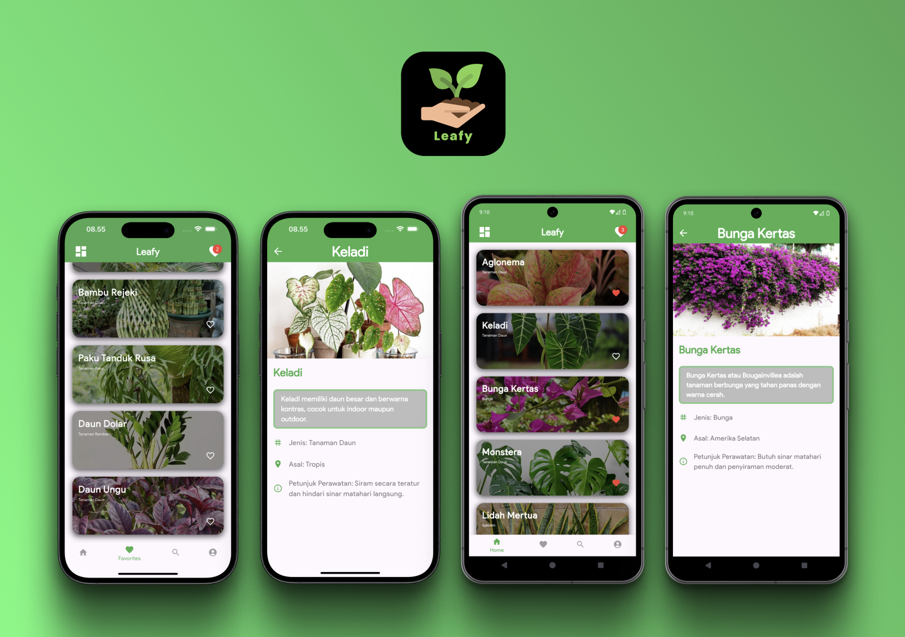

# 🌿 Leafy: Ornamental Plants Flutter App

Welcome to *Leafy*, my very first Flutter project! 🎉 Dive into the world of ornamental plants with this app, where you can explore detailed information about various plants, including their names, types, descriptions, and care instructions. Plus, enjoy a photo gallery showcasing beautiful images of each plant.

## 🪴 What's Inside?

**Plant Info:** Discover detailed descriptions of each plant, including what makes them special.  
**Type & Origin:** Learn about the type and origin of each plant to understand its background.  
**Care Instructions:** Get tips on how to take care of your plants so they thrive.  
**Photo Gallery:** Enjoy stunning images of the plants right from the detail page.

## 🎯 Why This App?

Because keeping track of your plants and learning about them should be as enjoyable and straightforward as possible! Whether you're an avid plant enthusiast or just starting your green journey, *Leafy* makes it easy to explore and care for your plants.

## 📸 Screenshots

Here’s a sneak peek at what you can expect:

